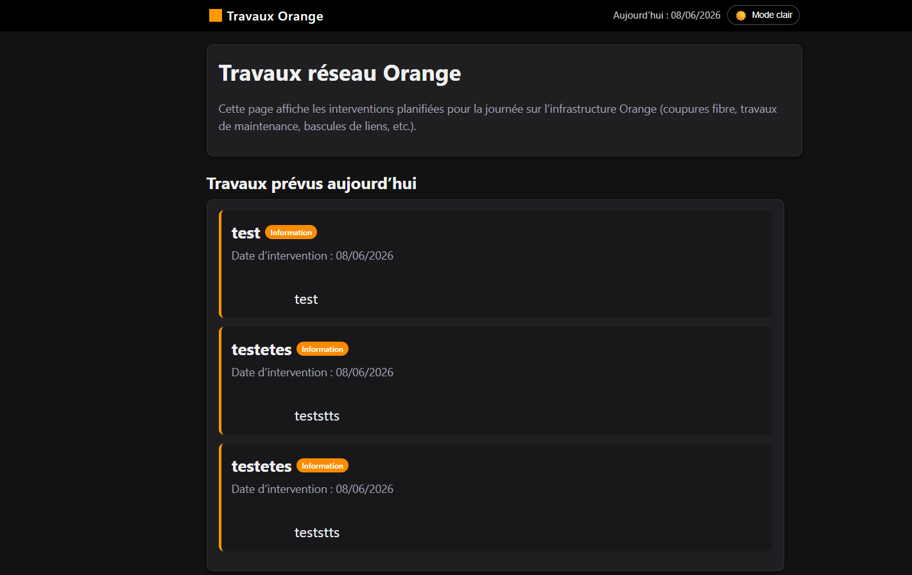
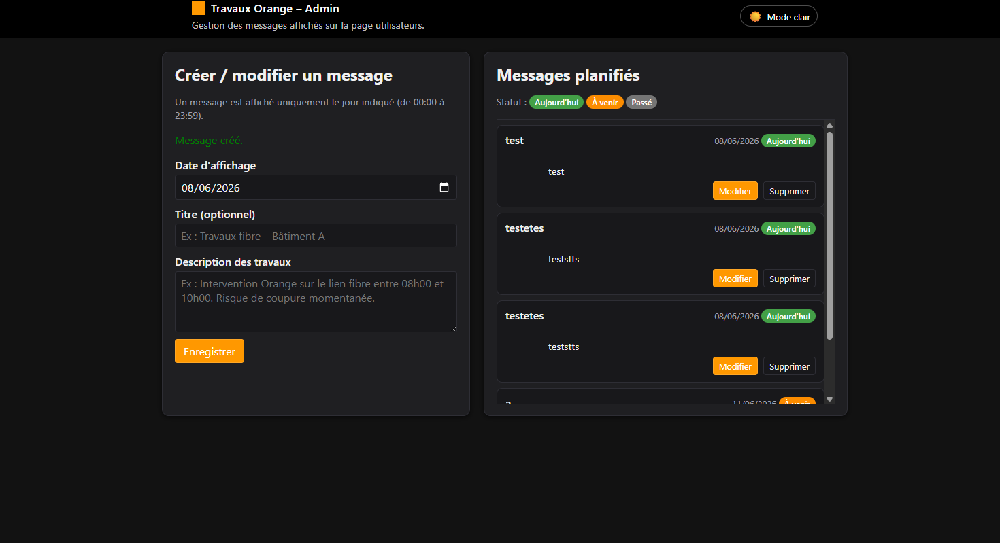

# Travaux Orange – Affichage des interventions

Application web interne permettant d’afficher sur un écran (TV de bureau) les travaux réseau Orange prévus pour la journée, avec une interface d’administration pour planifier les messages.




## Fonctionnalités

- Affichage en **temps réel** des interventions prévues pour la date du jour (00:00 → 23:59).
- Interface **utilisateur** optimisée pour écran TV (typo agrandie, mise en page épurée).
- Interface **admin** pour :
  - créer / modifier / supprimer des messages de travaux,
  - saisir une date d’affichage (obligatoire),
  - saisir un titre (optionnel),
  - saisir une description détaillée des travaux.
- **Dark mode / Light mode** avec bascule et préférence mémorisée dans le navigateur.
- Nettoyage automatique des messages expirés via un **cron** (suppression des dates passées).
- Stockage centralisé en **SQLite** via PDO (aucun serveur SQL externe requis).

## Stack technique

- **Backend** : PHP 8.x (ou supérieur) avec extension `PDO_SQLITE` activée.
- **Base de données** : SQLite (fichier `data/travaux.db` créé automatiquement).
- **Frontend** : HTML5, CSS3, JavaScript vanilla (pas de framework).
- **Thème** : variables CSS + `data-theme="light|dark"` + `localStorage` pour persister le thème.

## Architecture du projet

```text
travaux-orange-sql/
  user.php          # Vue TV : affichage des travaux du jour
  admin.php         # Back-office : gestion des messages
  db.php            # Connexion SQLite + création de la table
  cleanup.php       # Script appelé par cron pour supprimer les anciens messages

  data/
    travaux.db      # Base SQLite (créée automatiquement au premier lancement)

  css/
    base.css        # Variables de thème, layout commun, dark/light mode
    user.css        # Styles spécifiques à la vue TV
    admin.css       # Styles spécifiques au back-office

  js/
    theme.js        # Gestion du thème (light/dark) + persistance navigateur
```

### Table `messages`

La table SQLite `messages` contient :

- `id` : entier, clé primaire auto-incrémentée.
- `display_date` : texte au format `YYYY-MM-DD`, date d’affichage du message.
- `title` : texte, titre optionnel du message.
- `body` : texte, description détaillée des travaux.
- `created_at` : timestamp de création (rempli automatiquement).

La création de la table est gérée par `db.php` au premier chargement de l’application.

## Installation

1. **Récupérer le projet**

```bash
git clone 
cd 
```

2. **Pré-requis PHP**

- PHP 8.x ou plus récent.
- Extension `pdo_sqlite` activée (`php -m | grep sqlite` doit retourner `pdo_sqlite` / `sqlite3`).

3. **Droits sur le dossier `data/`**

Assure-toi que PHP peut écrire dans le répertoire `data/` (création du fichier `travaux.db`) :

```bash
mkdir -p data
chmod 775 data
```

(Adapté selon ta politique de droits / utilisateur du serveur web.)

4. **Lancer le serveur en local (développement)**

Depuis la racine du projet :

```bash
php -S 0.0.0.0:8080
```

Puis :

- Vue TV : `http://localhost:8080/user.php`
- Admin : `http://localhost:8080/admin.php`

En production, ces fichiers seront servis par Apache/Nginx (VirtualHost / config interne de ton intranet).

## Configuration du cron (nettoyage des anciennes dates)

Le script `cleanup.php` supprime les messages dont `display_date` est strictement antérieure à la date du jour :

```php
DELETE FROM messages WHERE display_date < :today
```

Sur un Linux classique, ajoute une entrée dans la crontab (par exemple, tous les jours à 03h00) :

```bash
crontab -e
```

Exemple de ligne de cron :

```cron
0 3 * * * /usr/bin/php /chemin/vers/travaux-orange-sql/cleanup.php >/dev/null 2>&1
```

Cela permet d’éviter que la base ne s’encombre de messages obsolètes à long terme.

## Utilisation

### 1. Interface admin (`admin.php`)

Accessible depuis un navigateur interne :

- URL typique : 

Fonctionnement :

1. **Créer un message**
   - Renseigner la **date d’affichage** (obligatoire).
   - (Optionnel) Renseigner un **titre** (ex. “Travaux fibre – Bâtiment A”).
   - Renseigner la **description** des travaux (ex. plage horaire, impact, remarque).
   - Cliquer sur **Enregistrer**.

2. **Modifier un message**
   - Dans la liste “Messages planifiés”, cliquer sur **Modifier** sur la ligne souhaitée.
   - Le formulaire est pré-rempli.
   - Modifier les champs nécessaires, puis cliquer sur **Mettre à jour**.

3. **Supprimer un message**
   - Cliquer sur **Supprimer** sur la ligne souhaitée.
   - Confirmer la suppression.

Les messages sont classés par date d’affichage, avec un badge indiquant le statut : Aujourd’hui / À venir / Passé.


### 2. Interface utilisateur / TV (`user.php`)

Accessible sur la TV :

- URL typique : 

Fonctionnement :

- La page affiche **uniquement les messages dont la date d’affichage est la date du jour**.
- Chaque carte affiche :
  - le titre (ou “Travaux Orange” par défaut),
  - la date d’intervention,
  - la description détaillée.
- L’interface est optimisée pour un affichage plein écran sur TV (typo agrandie).

Recommandations :

- Ouvrir la page en **plein écran** (F11 dans la plupart des navigateurs).
- Choisir le **mode sombre ou clair** via le switch en haut à droite :
  - la préférence est mémorisée (localStorage) et réappliquée au prochain chargement du navigateur.

## Personnalisation

- **Charte graphique** :
  - Couleurs principales définies dans `css/base.css` (`--accent`, `--bg`, etc.).
  - Styles spécifiques TV dans `css/user.css`.
  - Styles back-office dans `css/admin.css`.

- **Fuseau horaire** :
  - S’assurer que le serveur utilise le bon timezone (`Europe/Paris`) dans `php.ini` ou via :
    ```php
    date_default_timezone_set('Europe/Paris');
    ```

- **Évolutions possibles** :
  - 
